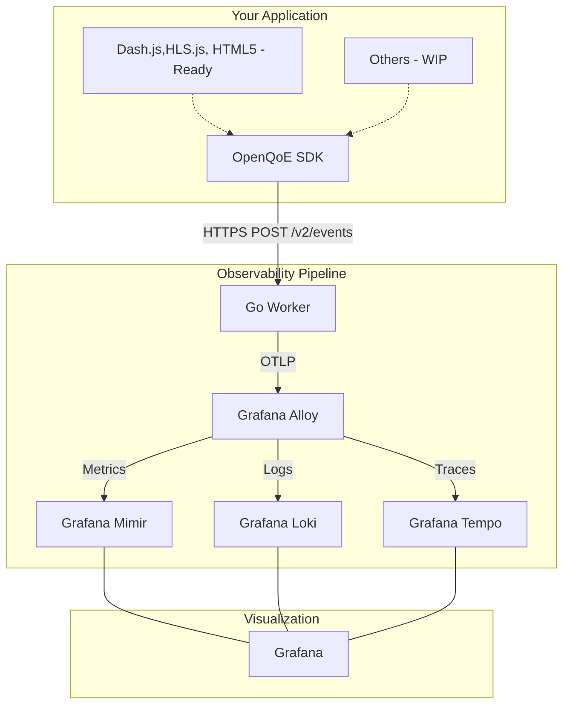

# OpenQoE

Open-Source Viewer Quality of Experience (QoE) Monitoring Platform for Video Streaming

[](LICENSE)
[](docs/contributing.md)
[](https://www.typescriptlang.org/)
[](https://go.dev/)

## Value Propositions

- Production-grade video quality monitoring for video players for all platforms(web, mobile, tv) with comprehensive business and technical metrics, accurate percentile calculations, real-time alerting, tracing and logging.
- Fully compatible with your existing observability infrastructure and tools (uses Open Telemetry Protocol for data export and Grafana for visualization).
- High Performance Low Latency Event Ingestion (Tested with p95 request latency of 30ms for event ingestion under load of 10k requests per second in an AWS m7a.large instance)
- Lightweight(from both compute and size perspective) SDK for player integration
- Easily Deployable on Kubernetes or any other container orchestration platform (npm package and docker image available)

## Current Status

- Web Player Integrations [Dash.js, Hls.js, HTML5 Player, Shaka Player, Video.js]: **Complete**
- Worker Implementation: **Complete**
- Open Telemetry Integration (Metrics, Traces, Logs): **Complete**
- Grafana Integration[Dashboard, Alerts]: **Complete**
- Mobile Player Integration: Planned

## Table of Contents

- [Overview](#overview)
- [Features](#features)
- [Architecture](#architecture)
- [Quick Start](#quick-start)
- [Documentation](#documentation)
- [Deployment Options](#deployment-options)
- [Metrics & Dashboards](#metrics--dashboards)
- [Contributing](#contributing)
- [License](#license)
- [Support](#support)

## Overview

OpenQoE is a complete, production-ready observability platform for video streaming that helps you:

- **Monitor Quality of Experience**: Track video startup time, playback smoothness, playback quality and errors
- **Understand Engagement**: Count views, watch time, completion rates, and viewer navigation behaviour
- **Optimize Performance**: Identify bottlenecks with P50/P95/P99 percentile analysis
- **Alert Proactively**: Get notified when different metrics degrade or business metrics drop
- **Scale Globally**: Deploy on anywhere using docker image, Helm Chart (Planned)

### What's Included

| Component               | Description                                  | Status                           |
| ----------------------- | -------------------------------------------- | -------------------------------- |
| **TypeScript SDK**      | 5 player adapters capturing 24+ event types  | Dash.js, HLS.js, HTML5 Player Integration Ready / Others WIP 🏗️ |
| **Go Worker**           | High-performance OTLP ingestion & processing | Production Ready              |
| **Grafana Alloy**       | Edge telemetry collector & processor         | Production Ready              |
| **Grafana Dashboards**  | 4 comprehensive dashboards (58 panels total) | Production Ready              |
| **Recording Rules**     | 25 pre-aggregated metrics for performance    | Production Ready              |
| **Alert Rules**         | 18 production-ready alerts                   | Production Ready              |
| **Distributed Tracing** | End-to-end tracing with Grafana Tempo        | Production Ready              |
| **Docker Stack**        | Self-hosted Mimir + Loki + Tempo + Alloy     | Production Ready              |

## Features

### SDK Capabilities

- **Multi-Player Support**: HTML5, Video.js, HLS.js, Dash.js, Shaka Player
- **Comprehensive Events**: 24+ event types with full context capture
- **Statistical Event Production**: For high frequency events 
- **Privacy-First**: SHA-256 hashing, configurable PII controls
- **Lightweight**: ~10KB gzipped per adapter
- **TypeScript**: Full type definitions included

### Go Worker Features

- **OTLP Ingestion**: Native support for OpenTelemetry protocol
- **High Concurrency**: Built with Go for scalable event processing
- **Cardinality Governance**: Automatic high-cardinality dimension management
- **Dual Destinations**: Self-hosted or Grafana Cloud
- **Health Monitoring**: Integrated health and stats endpoints

### Observability Stack

- **Full OTLP Pipeline**: Alloy -> Mimir/Loki/Tempo
- **Distributed Tracing**: End-to-end visibility with Tempo
- **4 Production Dashboards**: Video Performance, Video QoE, Video QoS, Worker Metrics
- **18 Alert Rules**: Critical quality and performance alerts
- **Self-Hosted**: Complete Docker Compose stack (Mimir, Loki, Tempo, Alloy, Grafana)

## Architecture



## Flow

1. SDK captures events from video players (Dash.js production ready)
2. Events batched and sent to Go Worker (`/v2/events`)
3. Worker validates and forwards via OTLP to Grafana Alloy
4. Alloy routes data to Mimir (metrics), Loki (logs), and Tempo (traces)
5. Grafana visualizes with pre-built dashboards and unified observability

## Local Setup

### 1. Clone Repository

```bash
git clone https://github.com/openqoe/openqoe-dev.git
cd openqoe-dev
```

### 2. You are an User (If you do not want to change anything)

#### 1. Start Observability Stack

```bash
# Start Mimir, Loki, Tempo, Alloy, and Grafana
docker compose up -d

# Verify all services are healthy
docker compose ps
```

#### 2. Run Examples

```bash
# while in root level
npm install -g http-server
http-server
# Open http://localhost:8080
```
### 2. You are a developer (If you want to change something)

#### 1. Build SDK

```bash
cd sdk
npm install
npm run build
npm test
```

#### 2. Build Go Worker (Assumes you have Go installed)

```bash
cd worker

# Install dependencies & build
go mod download
go build -o openqoe-worker

# Configure environment (OTEL_URL=http://localhost:4317)
cp .env.example .env

# Run the worker
./openqoe-worker
# Worker available at http://localhost:8788
```

### 3. Integrate SDK (Dash.js Example)

```html
<script type="module">
  import { OpenQoE } from "./sdk/dist/index.js";

  const qoe = new OpenQoE({
    orgId: "my-org",
    playerId: "my-website",
    endpointUrl: "http://localhost:8788/v2/events",
  });

  const player = dashjs.MediaPlayer().create();
  player.initialize(videoElement, url, true);

  qoe.attachPlayer("dashjs", player, {
    videoId: "video-123",
    videoTitle: "Production Stream",
  });
</script>
```

### 5. View Dashboards & Traces

1. Open Grafana: [localhost:3000](http://localhost:3000) (admin/admin)
2. Navigate to **Dashboards** → **OpenQoE** folder
3. Explore **Video Performance**, **Video QoE** or **Video QoS**
4. If you want to monitor the health of the worker, see **Worker Metrics**


## Documentation

### Getting Started

| Document                                     | Description                                          |
| -------------------------------------------- | ---------------------------------------------------- |
| [Deployment Guide](docs/deployment-guide.md) | Go Worker and Alloy Setup and deployment             |
| [API Reference](docs/api-reference.md)       | V2 Event Schemas and OTLP details                    |
| [SDK Integration](docs/sdk-integration.md)   | Dash.js, HLS.js, HTML5 focus (other players WIP)     |
| [Architecture](docs/architecture.md)         | Distributed observability pipeline                   |
| [Production Ready](docs/production-ready.md) | Production readiness report (Dash.js, HLS.js, HTML5) |

### Architecture & Design

| Document                                            | Description                              |
| --------------------------------------------------- | ---------------------------------------- |
| [Architecture Overview](docs/architecture.md)       | System architecture and component design |
| [Technical Specification](docs/technical-spec.md)   | Detailed technical specifications        |
| [Data Model](docs/data-model.md)                    | Event schemas and data structures        |
| [Production Ready Status](docs/production-ready.md) | Complete production readiness report     |

### Observability

| Document                                                                      | Description                                       |
| ----------------------------------------------------------------------------- | ------------------------------------------------- |
| [Observability README](docs/observability/README.md)                          | Stack overview, metrics, queries, troubleshooting |
| [Dashboard Documentation](docs/observability/dashboards.md)                   | Dashboard specifications and panel details        |
| [Recording Rules](observability/prometheus/rules/openqoe-recording-rules.yml) | 25 pre-aggregated metrics                         |
| [Alert Rules](observability/prometheus/rules/openqoe-alert-rules.yml)         | 18 production alerts                              |

### Component READMEs

| Component | README                                   |
| --------- | ---------------------------------------- |
| SDK       | [sdk/README.md](sdk/README.md)           |
| Worker    | [worker/README.md](worker/README.md)     |
| Examples  | [examples/README.md](examples/README.md) |


## Metrics & Dashboards

### Dashboard Overview

| Dashboard              | Panels | Purpose               | Key Metrics                               |
| ---------------------- | ------ | --------------------- | ----------------------------------------- |
| **Video Performance**  | 6      | Content Performance   | View Counting, Unique Viewers and repeated viewers count, user engagement and retention   |
| **Video QoE**          | 15     | Quality of Experience | Page Load Time, Vidoe Startup time, Quality related metrics, Playback Quality Metrics etc |
| **Video QoS**          | 4      | Quality of Service    | Network Bandwidth Change Rate, Network Latency Deviation, Video and Audio Fragment Latency and Bitrate         |
| **Impact Explorer**    | 4      | Worker Health         | Request Processing Time, Stack Usage, Heap Usage |

> More Raw Metrics can be found in Grafana's Drilldown section. Dashboards for those existing metrics and new metrics are on the way!


### Events Tracked (19 Total)

| Event                    | Description                                   | Business Value                                   |
| ------------------------ | --------------------------------------------- |------------------------------------------------ |
| `playerready`            | Player initialized and ready for input        | **Time to interactive** - UI responsiveness      |
| `manifestload`           | Manifest/playlist fetched and parsed          | **Content delivery measurement** - CDN perf      |
| `fragmentloaded`         | Video fragment successfully downloaded        | **Buffer fill tracking** - Network efficiency    |
| `canplay`                | Playback can begin (enough buffer)            | **Startup readiness** - Data availability        |
| `playing`                | Playback actually started                     | **Video Startup Time (VST)** - P95 latency       |
| `bandwidthchange`        | Network bandwidth measurement updated         | **ABR trigger analysis** - Adaptation triggers   |
| `qualitychangerequested` | Quality switch requested by ABR algorithm     | **ABR responsiveness** - Algorithm effectiveness |
| `qualitychange`          | Quality actually changed (new bitrate active) | **Bitrate adaptation** - User experience impact  |
| `bufferlevelchange`      | Video buffer level changed                    | **Buffer health** - Stall prediction             |
| `stallstart`             | Rebuffering event started                     | **Rebuffering detection** - QoE degradation      |
| `stallend`               | Rebuffering event ended                       | **Rebuffer duration** - Stall metrics (P95)      |
| `seek`                   | User seeked to different position             | **Seek latency** - Navigation UX                 |
| `pause`                  | User paused playback                          | **Engagement measurement** - Watch patterns      |
| `heartbeat`              | Periodic ping (typically 10s intervals)       | **Watch time tracking** - Accurate view metrics  |
| `quartile`               | Playback reached 25%, 50%, 75%, or 100%       | **Drop-off analysis** - Viewer retention funnel  |
| `ended`                  | Video playback completed                      | **Completion rate** - Content success metric     |
| `error`                  | Playback error occurred                       | **Error tracking** - SLA monitoring & debugging  |
| `moveaway`               | User navigated away from player               | **Session detection** - Window blur detection    |
| `moveback`               | User returned to player after moving away     | **Re-engagement tracking** - Viewer behavior     |

## Contributing

We welcome contributions! Whether it's:

- Bug reports
- Feature requests
- Documentation improvements
- Code contributions

Please read our [Contributing Guide](contributing.md) for guidelines.

### Quick Contribution Steps

1. Fork the repository
2. Create a feature branch (`git checkout -b feature/amazing-feature`)
3. Make your changes
4. Commit with clear messages (`git commit -m 'Add amazing feature'`)
5. Push to your branch (`git push origin feature/amazing-feature`)
6. Open a Pull Request

---

## License

This project is licensed under the **Apache License 2.0** - see the [LICENSE](LICENSE) file for details.

```
Copyright 2026-27 OpenQoE Contributors

Licensed under the Apache License, Version 2.0 (the "License");
you may not use this file except in compliance with the License.
You may obtain a copy of the License at

    http://www.apache.org/licenses/LICENSE-2.0

Unless required by applicable law or agreed to in writing, software
distributed under the License is distributed on an "AS IS" BASIS,
WITHOUT WARRANTIES OR CONDITIONS OF ANY KIND, either express or implied.
See the License for the specific language governing permissions and
limitations under the License.
```

## Support

### Community Support

- 🌐 **Website**: [https://openqoe.dev](https://openqoe.dev)
- 📖 **Documentation**: Start with [docs/deployment-guide.md](docs/deployment-guide.md)
- 🐛 **Bug Reports**: [GitHub Issues](https://github.com/openqoe/openqoe-dev/issues)
- 💡 **Feature Requests**: [GitHub Discussions](https://github.com/openqoe/openqoe-dev/discussions)
- 💬 **Questions**: [GitHub Discussions Q&A](https://github.com/openqoe/openqoe-dev/discussions/categories/q-a)

### Getting Help

1. Check the [documentation](#documentation)
2. Search [existing issues](https://github.com/openqoe/openqoe-dev/issues)
3. Check [troubleshooting guide](docs/observability/README.md#troubleshooting)
4. Ask in [Discussions](https://github.com/openqoe/openqoe-dev/discussions)


## Acknowledgments

OpenQoE is built with:

- **TypeScript** - Type safe development
- **Go** - Low Latency highly concurrent native application with strict type safety
- **Grafana Alloy** - Open Telemetry collector for Observability Signals
- **Grafana Mimir** - Prometheus-compatible metrics storage
- **Grafana Loki** - Log aggregation
- **Grafana Tempo** - Trace Correleation
- **Grafana** - Visualization platform
- **Docker** - Containerization

Inspired by commercial QoE monitoring solutions for continuous improvement and industry best practices.


## Future Roadmap

#### Immediate Focus: Ecosystem Compatibility
Our immediate target is to achieve broad compatibility with the remaining major web video players:

- video.js
- Shaka Player

This ensures fast adoption and positions the platform as player-agnostic.

###  Strategic Direction: Two Core Verticals:
Once baseline compatibility is achieved, the roadmap is divided into two verticals:
- Lowering the bar for understanding the data
- Advancing the underlying technology

###  Long-Term Vision
The end state is a self-optimizing video delivery platform where:
- Data is understandable without deep expertise
- QoE is predicted, not just measured
- Delivery paths adapt dynamically across players, CDNs, and network types
- Monetization and experience are optimized together

## 🙏 Star Us

If you find OpenQoE useful, please consider giving us a star ⭐ on GitHub. It helps others discover the project!

[](https://github.com/openqoe/openqoe-dev)

---

**Made with ❤️ by the OpenQoE Community**
