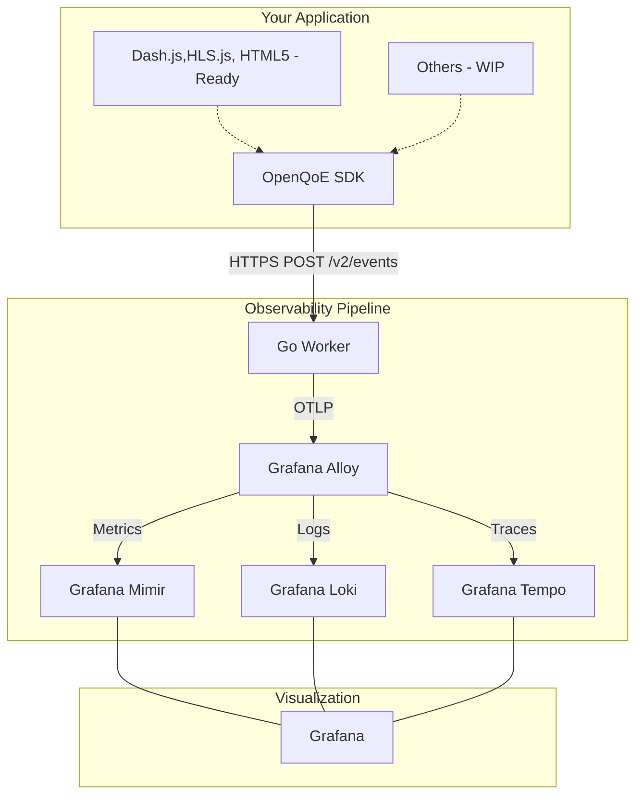

# OpenQoE

**Open-Source Video Quality of Experience (QoE) Monitoring Platform**

[](LICENSE)
[](docs/production-ready.md)
[](https://www.typescriptlang.org/)
[](https://go.dev/)
[](docs/contributing.md)

> **Production-grade video quality monitoring for web video players with comprehensive business and technical metrics, accurate percentile calculations, real-time alerting, and distributed tracing.**

> **Guarantee of p90 request latency of <=30ms for event insgestion under any load**

---

## 📋 Table of Contents

- [Overview](#overview)
- [Features](#features)
- [Architecture](#architecture)
- [Quick Start](#quick-start)
- [Documentation](#documentation)
- [Deployment Options](#deployment-options)
- [Metrics & Dashboards](#metrics--dashboards)
- [Contributing](#contributing)
- [License](#license)
- [Support](#support)

---

## 🎯 Overview

OpenQoE is a complete, production-ready observability platform for video streaming that helps you:

- **Monitor Quality**: Track video startup time, rebuffering, errors, and playback quality
- **Understand Engagement**: Measure watch time, completion rates, and viewer behavior
- **Optimize Performance**: Identify bottlenecks with P50/P95/P99 percentile analysis
- **Alert Proactively**: Get notified when quality degrades or business metrics drop
- **Scale Globally**: Deploy on Cloudflare's edge network or self-host

### What's Included

| Component               | Description                                  | Status                           |
| ----------------------- | -------------------------------------------- | -------------------------------- |
| **JavaScript SDK**      | 5 player adapters capturing 24+ event types  | ✅ Dash.js Ready / 🏗️ Others WIP |
| **Go Worker**           | High-performance OTLP ingestion & processing | ✅ Production Ready              |
| **Grafana Alloy**       | Edge telemetry collector & processor         | ✅ Production Ready              |
| **Grafana Dashboards**  | 4 comprehensive dashboards (58 panels total) | ✅ Production Ready              |
| **Recording Rules**     | 25 pre-aggregated metrics for performance    | ✅ Production Ready              |
| **Alert Rules**         | 18 production-ready alerts                   | ✅ Production Ready              |
| **Distributed Tracing** | End-to-end tracing with Grafana Tempo        | ✅ Production Ready              |
| **Docker Stack**        | Self-hosted Mimir + Loki + Tempo + Alloy     | ✅ Production Ready              |

---

## ✨ Features

### SDK Capabilities

- ✅ **Multi-Player Support**: HTML5, Video.js, HLS.js, Dash.js, Shaka Player
- ✅ **Dash.js Production Ready**: Robust integration for MPEG-DASH
- 🏗️ **WIP Adapters**: Other players are in active development
- ✅ **Comprehensive Events**: 24+ event types with full context capture
- ✅ **Privacy-First**: SHA-256 hashing, configurable PII controls
- ✅ **Lightweight**: ~10KB gzipped per adapter
- ✅ **TypeScript**: Full type definitions included

### Go Worker Features

- ✅ **OTLP Ingestion**: Native support for OpenTelemetry protocol
- ✅ **High Concurrency**: Built with Go for scalable event processing
- ✅ **Cardinality Governance**: Automatic high-cardinality dimension management
- ✅ **Dual Destinations**: Self-hosted or Grafana Cloud
- ✅ **Health Monitoring**: Integrated health and stats endpoints

### Observability Stack

- ✅ **Full OTLP Pipeline**: Alloy -> Mimir/Loki/Tempo
- ✅ **Distributed Tracing**: End-to-end visibility with Tempo
- ✅ **4 Production Dashboards**: VOD, Live, Quality, Impact Explorer
- ✅ **18 Alert Rules**: Critical quality and performance alerts
- ✅ **Self-Hosted**: Complete Docker Compose stack (Mimir, Loki, Tempo, Alloy, Grafana)

---

## 🏗️ Architecture



**Flow**:

1. SDK captures events from video players (Dash.js production ready)
2. Events batched and sent to Go Worker (`/v2/events`)
3. Worker validates and forwards via OTLP to Grafana Alloy
4. Alloy routes data to Mimir (metrics), Loki (logs), and Tempo (traces)
5. Grafana visualizes with pre-built dashboards and unified observability

---

### 1. Clone Repository

```bash
git clone https://github.com/openqoe/openqoe-dev.git
cd openqoe-dev
```

### 2. Start Observability Stack

```bash
# Start Mimir, Loki, Tempo, Alloy, and Grafana
docker compose up -d

# Verify all services are healthy
docker compose ps
```

### 3. Start Go Worker

```bash
cd worker

# Install dependencies & build
go mod download
go build -o openqoe-worker

# Configure environment (OTEL_URL=http://localhost:4317)
cp .env.example .env

# Run the worker
./openqoe-worker
# Worker available at http://localhost:8788
```

### 4. Integrate SDK (Dash.js Example)

```html
<script type="module">
  import { OpenQoE } from "./sdk/dist/index.js";

  const qoe = new OpenQoE({
    orgId: "my-org",
    playerId: "my-website",
    endpointUrl: "http://localhost:8788/v2/events",
  });

  const player = dashjs.MediaPlayer().create();
  player.initialize(videoElement, url, true);

  qoe.attachPlayer("dashjs", player, {
    videoId: "video-123",
    videoTitle: "Production Stream",
  });
</script>
```

### 5. View Dashboards & Traces

1. Open Grafana: [localhost:3000](http://localhost:3000) (admin/admin)
2. Navigate to **Dashboards** → **OpenQoE** folder
3. Explore **VOD Monitoring** or **Impact Explorer**
4. Use the **Explore** tab to view distributed traces in Tempo

**OpenQoE v2 is ready!** 🚀

---

## 📚 Documentation

### Getting Started

| Document                                     | Description                                          |
| -------------------------------------------- | ---------------------------------------------------- |
| [Deployment Guide](docs/deployment-guide.md) | Go Worker and Alloy Setup and deployment             |
| [API Reference](docs/api-reference.md)       | V2 Event Schemas and OTLP details                    |
| [SDK Integration](docs/sdk-integration.md)   | Dash.js, HLS.js, HTML5 focus (other players WIP)     |
| [Architecture](docs/architecture.md)         | Distributed observability pipeline                   |
| [Production Ready](docs/production-ready.md) | Production readiness report (Dash.js, HLS.js, HTML5) |

3. Open **VOD Monitoring** dashboard
4. Play a video and watch metrics appear in real-time!

**That's it!** Your video QoE monitoring is now live. 🎉

### Architecture & Design

| Document                                            | Description                              |
| --------------------------------------------------- | ---------------------------------------- |
| [Architecture Overview](docs/architecture.md)       | System architecture and component design |
| [Technical Specification](docs/technical-spec.md)   | Detailed technical specifications        |
| [Data Model](docs/data-model.md)                    | Event schemas and data structures        |
| [Production Ready Status](docs/production-ready.md) | Complete production readiness report     |

### Observability

| Document                                                                      | Description                                       |
| ----------------------------------------------------------------------------- | ------------------------------------------------- |
| [Observability README](docs/observability/README.md)                          | Stack overview, metrics, queries, troubleshooting |
| [Dashboard Documentation](docs/observability/dashboards.md)                   | Dashboard specifications and panel details        |
| [Recording Rules](observability/prometheus/rules/openqoe-recording-rules.yml) | 25 pre-aggregated metrics                         |
| [Alert Rules](observability/prometheus/rules/openqoe-alert-rules.yml)         | 18 production alerts                              |

### Component READMEs

| Component | README                                   |
| --------- | ---------------------------------------- |
| SDK       | [sdk/README.md](sdk/README.md)           |
| Worker    | [worker/README.md](worker/README.md)     |
| Examples  | [examples/README.md](examples/README.md) |

---

## 🌍 Deployment Options

### Option 1: Self-Hosted (Docker)

**Best for**: On-premise deployments, full control, data sovereignty

```bash
# Start complete stack
docker compose up -d

# Configure worker for localhost
cd worker && npm run dev
```

**Includes**: Mimir (metrics), Loki (logs), Grafana (dashboards)

**Docs**: [Self-Hosted Deployment](docs/deployment-guide.md#option-1-self-hosted-docker-stack)

---

### Option 2: Grafana Cloud

**Best for**: Managed service, zero infrastructure, global scale

```bash
# Configure worker in .env
DESTINATION_TYPE=GrafanaCloud
GRAFANA_CLOUD_INSTANCE_ID=123456
GRAFANA_CLOUD_API_KEY=your-api-key

# Run worker
./openqoe-worker
```

**Docs**: [Grafana Cloud Deployment](docs/deployment-guide.md#option-3-grafana-cloud)

---

### Option 3: Hybrid (Self-Hosted + Managed Worker)

**Best for**: Distributed ingestion with on-premise storage

Combine regional Go workers for global ingestion with a central self-hosted observability stack.

**Docs**: [Hybrid Deployment](docs/deployment-guide.md#network-connectivity-for-self-hosted-deployments)

---

## 📊 Metrics & Dashboards

### Dashboard Overview

| Dashboard              | Panels | Purpose               | Key Metrics                               |
| ---------------------- | ------ | --------------------- | ----------------------------------------- |
| **VOD Monitoring**     | 21     | Real-time VOD quality | VST, rebuffering, completion, quartiles   |
| **Live Streaming**     | 11     | Live event monitoring | Concurrent viewers, join time, geographic |
| **Quality & Delivery** | 12     | Technical deep-dive   | Seek latency, dropped frames, ABR         |
| **Impact Explorer**    | 14     | Business analysis     | Watch time, engagement, revenue           |

### Key Metrics Captured

**Business Metrics**:

- Total views, completion rate, watch time
- Revenue impact calculations
- Engagement by quartile (25/50/75/100%)
- Content performance comparison

**Technical Metrics**:

- Video Startup Time (P50/P95/P99 via histograms)
- Rebuffer rate, duration, and frequency
- Seek latency and performance
- Error rates by type and family
- Bitrate distribution and ABR behavior
- Dropped frames and rendering quality
- Resolution distribution (360p-8K)
- Buffer health

**Live Streaming**:

- Concurrent viewers (real-time)
- Join time (P95)
- Geographic distribution
- Viewer drop detection

### Histogram Metrics

OpenQoE uses **true histograms** (not gauges) for accurate percentile calculations:

```promql
# Accurate P95 Video Startup Time
histogram_quantile(0.95,
  sum(rate(openqoe_video_startup_seconds_bucket[5m])) by (le)
)

# Using pre-aggregated recording rule (10-50x faster)
openqoe:video_startup_seconds:p95
```

**Histogram buckets configured**:

- **VST**: [0.5, 1, 2, 3, 5, 10, 15, 30] seconds
- **Rebuffer Duration**: [0.5, 1, 2, 3, 5, 10, 30] seconds
- **Seek Latency**: [0.1, 0.25, 0.5, 1, 2, 5] seconds

---

## 🎨 Supported Players

| Player           | Adapter          | Status                  |
| ---------------- | ---------------- | ----------------------- |
| **Dash.js**      | `DashJsAdapter`  | ✅ **Production Ready** |
| **HTML5**        | `HTML5Adapter`   | 🏗️ Work In Progress     |
| **Video.js**     | `VideoJsAdapter` | 🏗️ Work In Progress     |
| **HLS.js**       | `HlsJsAdapter`   | 🏗️ Work In Progress     |
| **Shaka Player** | `ShakaAdapter`   | 🏗️ Work In Progress     |

\*HTML5 doesn't support `quality_change` events (no native ABR)

### Events Tracked (19 Total)

| Event                    | Description                                   | Business Value                                   |
| ------------------------ | --------------------------------------------- | ------------------------------------------------ |
| `playerready`            | Player initialized and ready for input        | **Time to interactive** - UI responsiveness      |
| `manifestload`           | Manifest/playlist fetched and parsed          | **Content delivery measurement** - CDN perf      |
| `fragmentloaded`         | Video fragment successfully downloaded        | **Buffer fill tracking** - Network efficiency    |
| `canplay`                | Playback can begin (enough buffer)            | **Startup readiness** - Data availability        |
| `playing`                | Playback actually started                     | **Video Startup Time (VST)** - P95 latency       |
| `bandwidthchange`        | Network bandwidth measurement updated         | **ABR trigger analysis** - Adaptation triggers   |
| `qualitychangerequested` | Quality switch requested by ABR algorithm     | **ABR responsiveness** - Algorithm effectiveness |
| `qualitychange`          | Quality actually changed (new bitrate active) | **Bitrate adaptation** - User experience impact  |
| `bufferlevelchange`      | Video buffer level changed                    | **Buffer health** - Stall prediction             |
| `stallstart`             | Rebuffering event started                     | **Rebuffering detection** - QoE degradation      |
| `stallend`               | Rebuffering event ended                       | **Rebuffer duration** - Stall metrics (P95)      |
| `seek`                   | User seeked to different position             | **Seek latency** - Navigation UX                 |
| `pause`                  | User paused playback                          | **Engagement measurement** - Watch patterns      |
| `heartbeat`              | Periodic ping (typically 10s intervals)       | **Watch time tracking** - Accurate view metrics  |
| `quartile`               | Playback reached 25%, 50%, 75%, or 100%       | **Drop-off analysis** - Viewer retention funnel  |
| `ended`                  | Video playback completed                      | **Completion rate** - Content success metric     |
| `error`                  | Playback error occurred                       | **Error tracking** - SLA monitoring & debugging  |
| `moveaway`               | User navigated away from player               | **Session detection** - Window blur detection    |
| `moveback`               | User returned to player after moving away     | **Re-engagement tracking** - Viewer behavior     |

---

## 🛠️ Development

### Project Structure

```
openqoe/
├── build
│   ├── build.ninja
│   ├── CMakeCache.txt
│   ├── CMakeFiles
│   │   ├── 3.28.3
│   │   │   ├── CMakeCXXCompiler.cmake
│   │   │   ├── CMakeDetermineCompilerABI_CXX.bin
│   │   │   ├── CMakeSystem.cmake
│   │   │   └── CompilerIdCXX
│   │   │       ├── a.out
│   │   │       ├── CMakeCXXCompilerId.cpp
│   │   │       └── tmp
│   │   ├── cmake.check_cache
│   │   ├── CMakeConfigureLog.yaml
│   │   ├── OpenQoEWorker.dir
│   │   │   └── src
│   │   ├── pkgRedirects
│   │   ├── rules.ninja
│   │   └── TargetDirectories.txt
│   ├── cmake_install.cmake
│   ├── compile_commands.json
│   └── OpenQoEWorker
├── compose.yaml
├── docs
│   ├── api-reference.md
│   ├── architecture.md
│   ├── contributing.md
│   ├── data-model.md
│   ├── deployment-checklist.md
│   ├── deployment-guide.md
│   ├── observability
│   │   ├── dashboards.md
│   │   └── README.md
│   ├── production-ready.md
│   ├── sdk-integration.md
│   └── technical-spec.md
├── examples
│   ├── dashjs-demo
│   │   └── index.html
│   ├── DEMO_TEMPLATE.md
│   ├── hlsjs-demo
│   │   └── index.html
│   ├── html5-demo
│   │   └── index.html
│   ├── README.md
│   ├── shaka-demo
│   │   └── index.html
│   └── videojs-demo
│       └── index.html
├── LICENSE
├── observability
│   ├── alloy
│   │   └── config.alloy
│   ├── dashboards
│   │   ├── impact-explorer.json
│   │   ├── live-streaming.json
│   │   ├── quality-delivery.json
│   │   └── vod-monitoring.json
│   ├── grafana
│   │   └── provisioning
│   │       ├── dashboards
│   │       │   └── dashboards.yml
│   │       └── datasources
│   │           └── datasources.yml
│   ├── GRAFANA_DASHBOARDS.md
│   ├── loki
│   │   └── loki-config.yaml
│   ├── mimir
│   │   ├── mimir-config.yml
│   │   └── runtime.yml
│   ├── prometheus
│   │   ├── prometheus.yml
│   │   └── rules
│   │       ├── load-rules.sh
│   │       ├── openqoe-alert-rules.yml
│   │       └── openqoe-recording-rules.yml
│   ├── README.md
│   └── tempo
│       └── tempo-config.yaml
├── openqoe-dev.code-workspace
├── README.md
├── sdk
│   ├── jest.config.js
│   ├── package.json
│   ├── package-lock.json
│   ├── README.md
│   ├── rollup.config.js
│   ├── src
│   │   ├── adapters
│   │   │   ├── DashJsAdapter.ts
│   │   │   ├── HlsJsAdapter.ts
│   │   │   ├── HTML5Adapter.ts
│   │   │   ├── ShakaAdapter.ts
│   │   │   └── VideoJsAdapter.ts
│   │   ├── core
│   │   │   ├── BatchManager.ts
│   │   │   ├── EventCollector.ts
│   │   │   ├── QueueManager.ts
│   │   │   ├── RetryManager.ts
│   │   │   ├── SessionManager.ts
│   │   │   └── Transport.ts
│   │   ├── index.ts
│   │   ├── OpenQoE.ts
│   │   ├── types.ts
│   │   └── utils
│   │       ├── device.ts
│   │       ├── logger.ts
│   │       └── privacy.ts
│   ├── tests
│   │   ├── core
│   │   │   ├── BatchManager.test.ts
│   │   │   └── SessionManager.test.ts
│   │   └── utils
│   │       └── privacy.test.ts
│   └── tsconfig.json
├── sonar-project.properties
├── test
│   ├── dashjs-test
│   │   └── index.html
│   ├── hlsjs-test
│   │   └── index.html
│   ├── html5-test
│   │   └── index.html
│   ├── shaka-test
│   │   └── index.html
│   └── videojs-test
│       └── index.html
└── worker
    ├── compute
    │   ├── events.go
    │   ├── helpers.go
    │   ├── metrics.go
    │   ├── system_metrics.go
    │   └── types.go
    ├── config
    │   ├── auth.go
    │   ├── cardinality.go
    │   ├── config.go
    │   ├── destination.go
    │   ├── env.go
    │   └── redis.go
    ├── data_structure
    │   ├── pair.go
    │   └── set.go
    ├── Dockerfile
    ├── go.mod
    ├── go.sum
    ├── main.go
    ├── middlewares
    │   ├── auth.go
    │   └── headers.go
    ├── otelservice
    │   ├── setup.go
    │   ├── tracer.go
    │   └── types.go
    ├── pool
    │   └── worker.go
    ├── README.md
    └── requesthandlers
        ├── controller.go
        ├── markdevice.go
        ├── requestvalidation.go
        └── types.go
```

### Build SDK

```bash
cd sdk
npm install
npm run build
npm test
```

### Run Worker Locally

```bash
cd worker
go build .
./worker
# Available at http://localhost:8788
```

### Run Examples

```bash
# while in root level
npm install -g http-server
http-server
# Open http://localhost:8080
```

---

## 🤝 Contributing

We welcome contributions! Whether it's:

- 🐛 Bug reports
- ✨ Feature requests
- 📝 Documentation improvements
- 🔧 Code contributions

Please read our [Contributing Guide](docs/contributing.md) for guidelines.

### Quick Contribution Steps

1. Fork the repository
2. Create a feature branch (`git checkout -b feature/amazing-feature`)
3. Make your changes
4. Commit with clear messages (`git commit -m 'Add amazing feature'`)
5. Push to your branch (`git push origin feature/amazing-feature`)
6. Open a Pull Request

---

## 📄 License

This project is licensed under the **Apache License 2.0** - see the [LICENSE](LICENSE) file for details.

```
Copyright 2026-27 OpenQoE Contributors

Licensed under the Apache License, Version 2.0 (the "License");
you may not use this file except in compliance with the License.
You may obtain a copy of the License at

    http://www.apache.org/licenses/LICENSE-2.0

Unless required by applicable law or agreed to in writing, software
distributed under the License is distributed on an "AS IS" BASIS,
WITHOUT WARRANTIES OR CONDITIONS OF ANY KIND, either express or implied.
See the License for the specific language governing permissions and
limitations under the License.
```

---

## 💬 Support

### Community Support

- 🌐 **Website**: [https://openqoe.dev](https://openqoe.dev)
- 📖 **Documentation**: Start with [docs/deployment-guide.md](docs/deployment-guide.md)
- 🐛 **Bug Reports**: [GitHub Issues](https://github.com/openqoe/openqoe-dev/issues)
- 💡 **Feature Requests**: [GitHub Discussions](https://github.com/openqoe/openqoe-dev/discussions)
- 💬 **Questions**: [GitHub Discussions Q&A](https://github.com/openqoe/openqoe-dev/discussions/categories/q-a)

### Getting Help

1. Check the [documentation](#documentation)
2. Search [existing issues](https://github.com/openqoe/openqoe-dev/issues)
3. Check [troubleshooting guide](docs/observability/README.md#troubleshooting)
4. Ask in [Discussions](https://github.com/openqoe/openqoe-dev/discussions)

---

## 🌟 Acknowledgments

OpenQoE is built with:

- **TypeScript** - Type safe development
- **Go** - Low Latency highly concurrent native application with strict type safety
- **Grafana Alloy** - Open Telemetry collector for Observability Signals
- **Grafana Mimir** - Prometheus-compatible metrics storage
- **Grafana Loki** - Log aggregation
- **Grafana Tempo** - Trace Correleation
- **Grafana** - Visualization platform
- **Docker** - Containerization

Inspired by commercial QoE monitoring solutions for continuous improvement and industry best practices.

---

## 📈 Project Status

**Current Version**: 2.0.0
**Status**: ✅ **Dash.js, HLS.js, HTML5 Ready** / 🏗️ **Core v2 In Beta**
**Last Updated**: January 2026

See [docs/production-ready.md](docs/production-ready.md) for complete production readiness report.

### What's Production Ready

- ✅ SDK for all 5 major web players
- ✅ Low Latency
- ✅ 4 comprehensive Grafana dashboards (58 panels)
- ✅ 25 recording rules for performance
- ✅ 18 production-ready alerts
- ✅ Self-hosted Docker stack
- ✅ Grafana Cloud support
- ✅ Complete documentation

### Roadmap

**Phase 2** (Optional):

- Worker Health Dashboard (pipeline monitoring)
- Advanced cardinality analytics
- Custom metric extensions
- Load testing framework

---

## 🙏 Star Us!

If you find OpenQoE useful, please consider giving us a star ⭐ on GitHub. It helps others discover the project!

[](https://github.com/openqoe/openqoe-dev)

---

**Made with ❤️ by the OpenQoE Community**
