# openqoe-core Architecture

**Version:** 2.0.0
**Last Updated:** January 2026

---

## Table of Contents

1. [System Architecture Overview](#system-architecture-overview)
2. [Component Architecture](#component-architecture)
3. [Data Flow Diagrams](#data-flow-diagrams)
4. [Deployment Architecture](#deployment-architecture)
5. [Security Architecture](#security-architecture)
6. [Scalability & Performance](#scalability--performance)

---

## System Architecture Overview

### High-Level Architecture

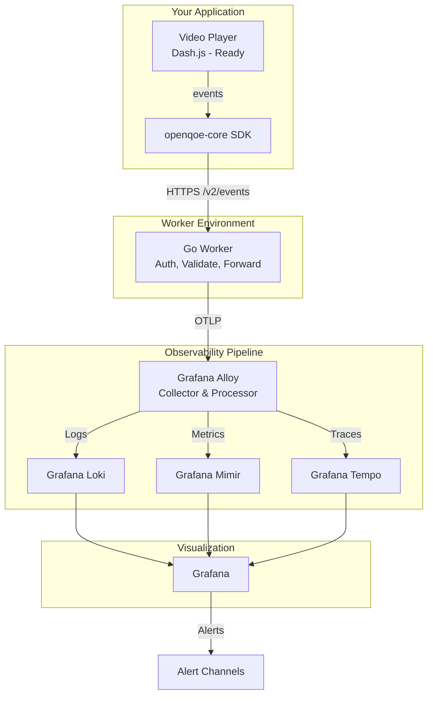

---

## Component Architecture

### 1. SDK Architecture

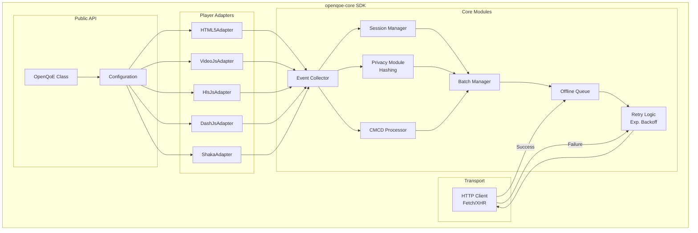

### 2. SDK Module Responsibilities

| Module | Responsibility | Interface |
|--------|----------------|-----------|
| **OpenQoE Class** | Public API, initialization, lifecycle | `new OpenQoE(config)`, `attachPlayer()`, `destroy()` |
| **Configuration** | Validate config, store settings | `OpenQoEConfig` interface |
| **Player Adapters** | Translate player-specific events to standard events | `PlayerAdapter` interface |
| **Event Collector** | Receive events, enrich with context | `trackEvent(type, data)` |
| **Session Manager** | Generate IDs, track session state | `startSession()`, `endSession()`, `getSessionId()` |
| **Privacy Module** | Hash PII fields, apply privacy policies | `hash(value)`, `sanitize(event)` |
| **CMCD Processor** | Extract, normalize, de-duplicate CMCD | `extractCMCD(player)`, `normalizeCMCD(data)` |
| **Batch Manager** | Accumulate events, trigger flushes | `addEvent(event)`, `flush()` |
| **Offline Queue** | Store events when offline, persist to storage | `enqueue(event)`, `dequeue()`, `persist()` |
| **Retry Logic** | Exponential backoff, circuit breaker | `send(batch)`, `retry(batch, attempt)` |
| **HTTP Client** | Send batches to ingest endpoint | `post(url, data)` |

### 3. PlayerAdapter Interface

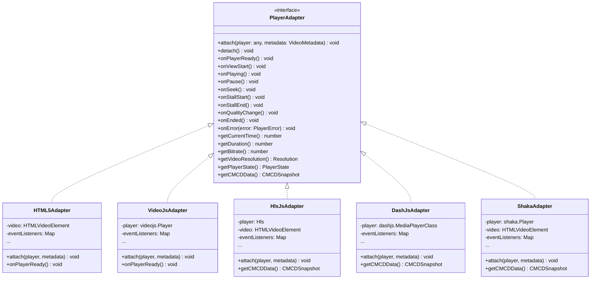

---

### 4. Go Worker Architecture

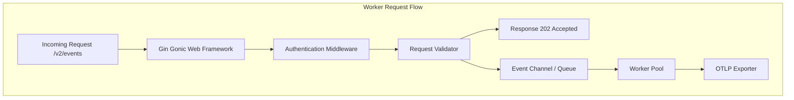

### 5. Worker Module Responsibilities

| Module | Responsibility |
|--------|----------------|
| **Gin Framework** | HTTP routing, middleware management, health checks |
| **Auth Middleware** | API key verification and Org ID resolution |
| **Request Validator** | Schema validation using Go Struct tags |
| **Worker Pool** | Concurrent processing of events from the queue |
| **Cardinality Service** | Governance of dimension values to prevent explosion |
| **OTLP Exporter** | Exporting metrics, logs, and traces to Alloy |

---

### 1. Event Lifecycle

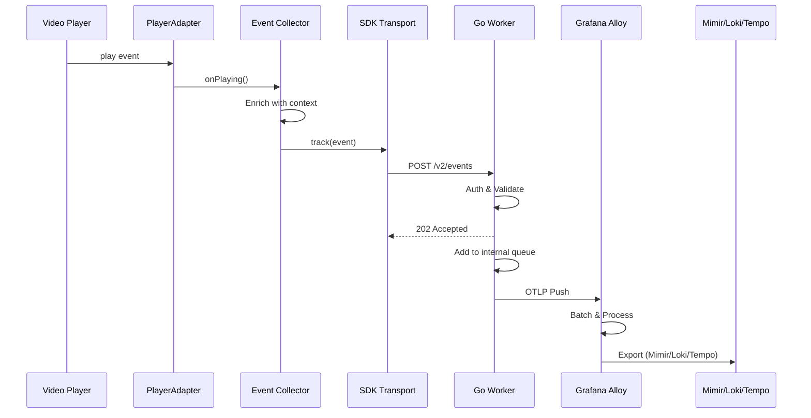

### 2. Error Handling Flow

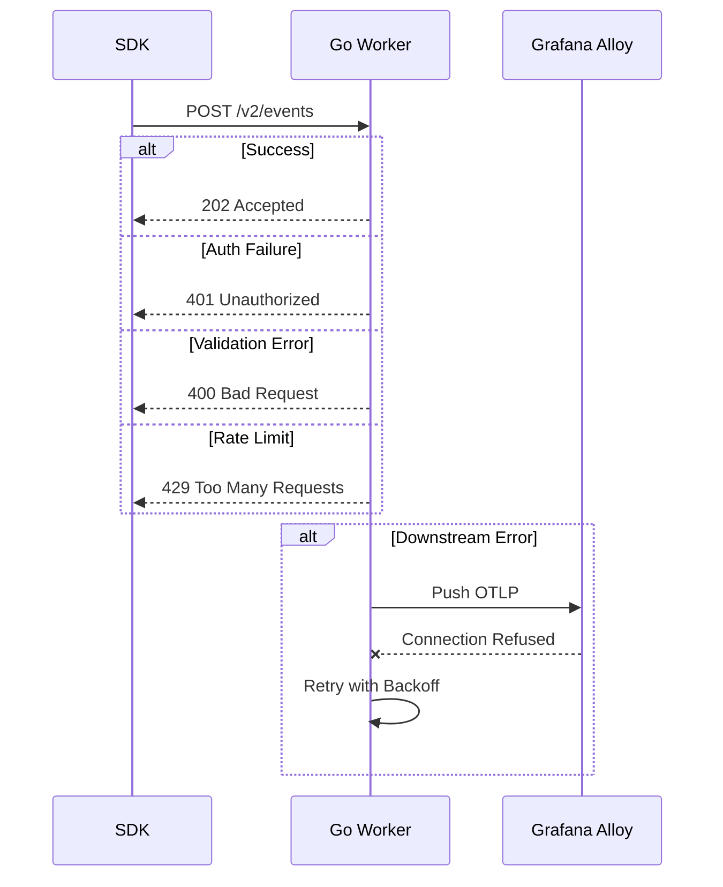

### 3. CMCD Extraction Flow

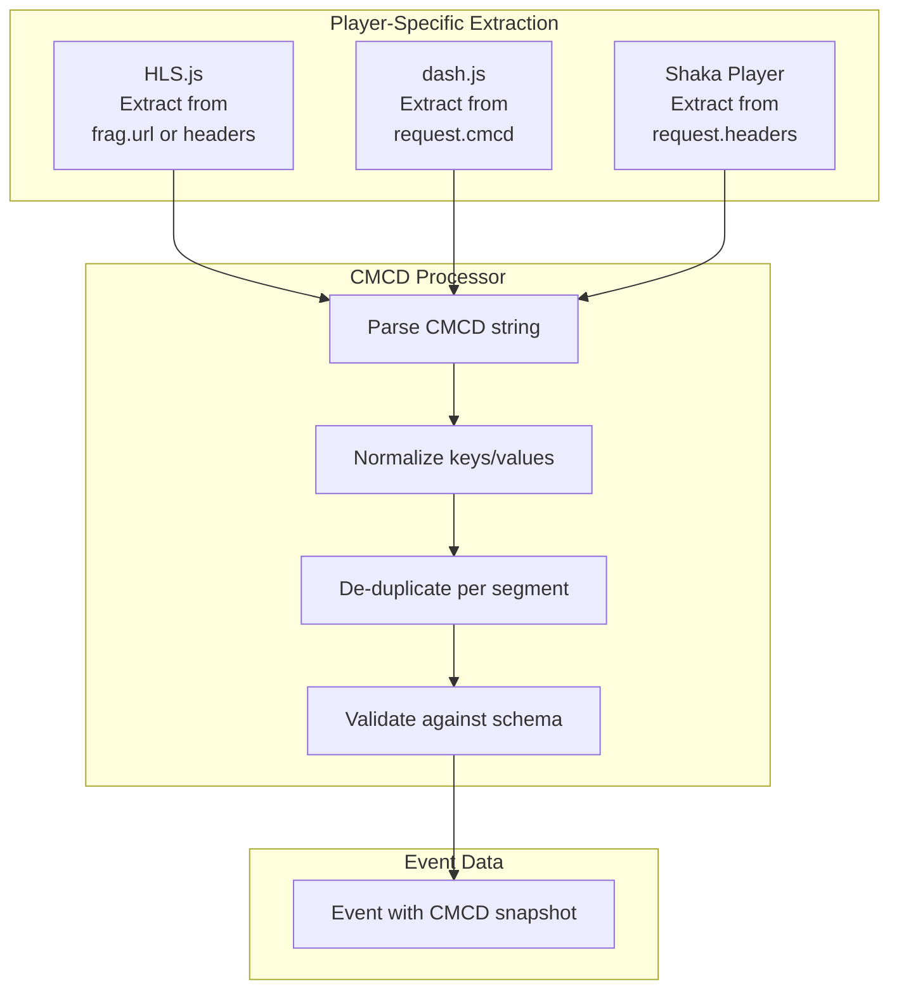

---

## Deployment Architecture

### 1. Multi-Environment Setup

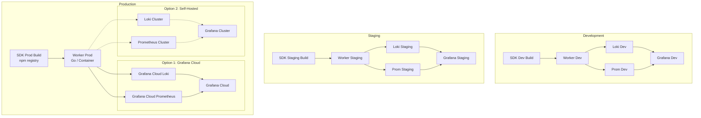

### 2. Geographic Distribution (Cloudflare Edge)

```
┌─────────────────────────────────────────────────────────────┐
│                    Cloudflare Global Network                 │
│                                                               │
│  ┌──────────────┐  ┌──────────────┐  ┌──────────────┐      │
│  │   Americas   │  │    Europe    │  │  Asia-Pacific│      │
│  │              │  │              │  │              │      │
│  │ ┌──────────┐ │  │ ┌──────────┐ │  │ ┌──────────┐ │      │
│  │ │  Worker  │ │  │ │  Worker  │ │  │ │  Worker  │ │      │
│  │ │  (Edge)  │ │  │ │  (Edge)  │ │  │ │  (Edge)  │ │      │
│  │ └──────────┘ │  │ └──────────┘ │  │ └──────────┘ │      │
│  │              │  │              │  │              │      │
│  │ 100+ POPs    │  │ 100+ POPs    │  │ 100+ POPs    │      │
│  └──────────────┘  └──────────────┘  └──────────────┘      │
│         │                  │                  │              │
└─────────┼──────────────────┼──────────────────┼──────────────┘
          │                  │                  │
          └──────────────────┴──────────────────┘
                             │
                             ▼
                  ┌──────────────────────┐
                  │ Backend (Centralized) │
                  │  - Loki               │
                  │  - Prometheus         │
                  │  - Grafana            │
                  └──────────────────────┘
```

**Benefits:**
- Low latency (<100ms) from any location
- High availability (auto-failover)
- DDoS protection
- Edge caching/routing

---

## Security Architecture

### 1. Security Layers

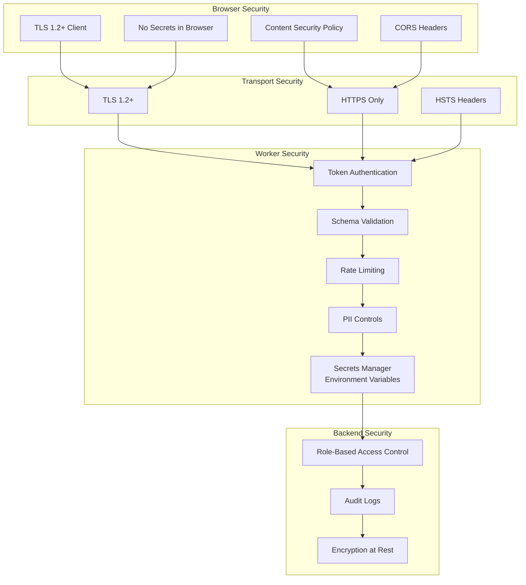

### 2. Authentication Flow

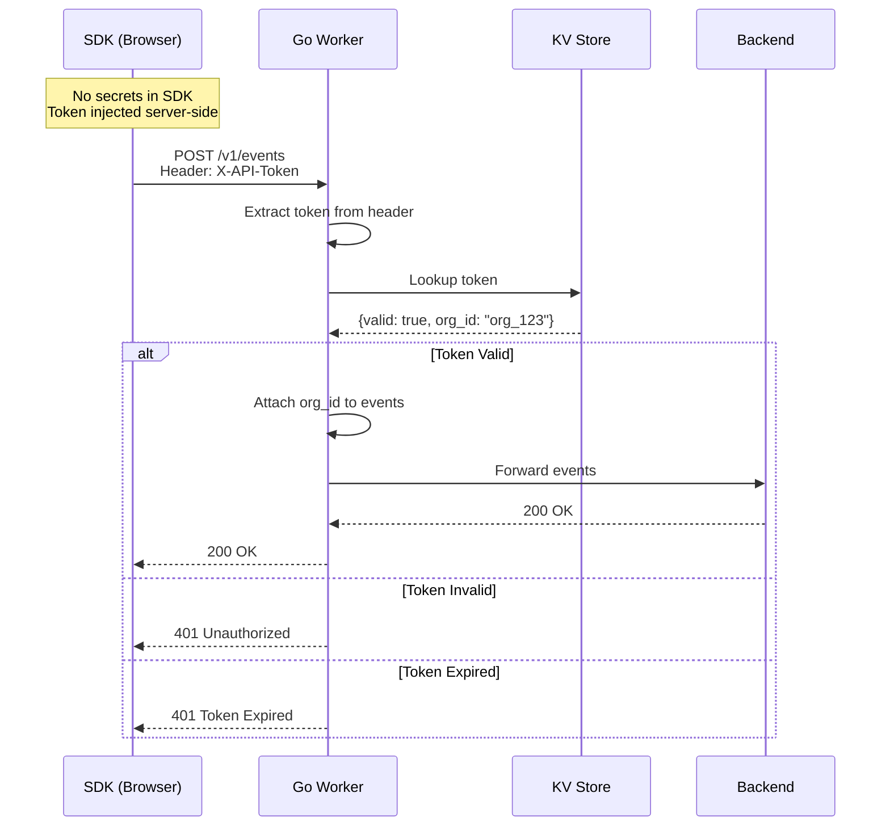

### 3. Privacy Architecture

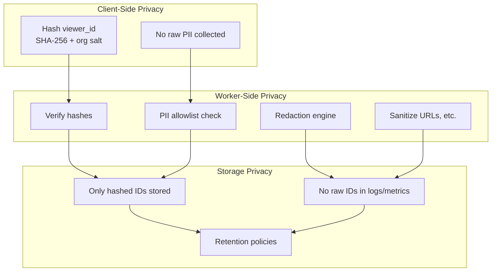

---

## Scalability & Performance

### 1. Scalability Tiers

```
┌────────────────────────────────────────────────────────────┐
│                       Tier S (Small)                        │
│  - Sustained: 5,000 events/s                               │
│  - Burst: 10,000 events/s                                  │
│  - Estimated viewers: ~500 concurrent                      │
│  - Use case: Small to medium sites                         │
└────────────────────────────────────────────────────────────┘

┌────────────────────────────────────────────────────────────┐
│                       Tier M (Medium)                       │
│  - Sustained: 25,000 events/s                              │
│  - Burst: 50,000 events/s                                  │
│  - Estimated viewers: ~2,500 concurrent                    │
│  - Use case: Medium to large sites                         │
└────────────────────────────────────────────────────────────┘

┌────────────────────────────────────────────────────────────┐
│                       Tier L (Large)                        │
│  - Sustained: 100,000 events/s                             │
│  - Burst: 200,000 events/s                                 │
│  - Estimated viewers: ~10,000 concurrent                   │
│  - Use case: Large platforms, streaming services           │
└────────────────────────────────────────────────────────────┘
```

### 2. Performance Optimizations

#### SDK Optimizations

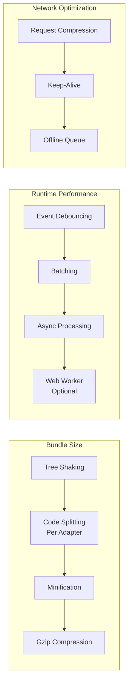

#### Worker Optimizations

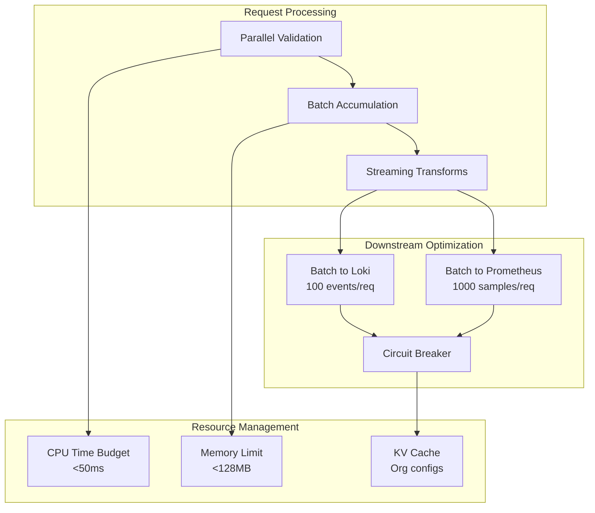

### 3. Monitoring & Observability

```mermaid
graph TB
    subgraph "SDK Metrics (Client-Side)"
        SDK_PERF[Performance.measure()<br/>Event capture time]
        SDK_MEM[Memory usage]
        SDK_NETWORK[Network requests]
        SDK_ERRORS[SDK errors]
    end

    subgraph "Worker Metrics (Edge)"
        WORKER_LATENCY[Request latency<br/>P50/P95/P99]
        WORKER_SUCCESS[Success rate]
        WORKER_ERRORS[Error rate by type]
        WORKER_REJECT[Reject rate by reason]
        WORKER_CPU[CPU time]
    end

    subgraph "Backend Metrics"
        LOKI_INGEST[Loki ingest rate]
        PROM_INGEST[Prometheus ingest rate]
        QUERY_LATENCY[Query latency]
        STORAGE[Storage usage]
    end

    subgraph "Alerting"
        ALERT_INGESTION[Ingest SLO alert]
        ALERT_LATENCY[Latency alert]
        ALERT_ERRORS[Error rate alert]
        ALERT_COST[Cost alert]
    end

    SDK_PERF --> WORKER_LATENCY
    SDK_NETWORK --> WORKER_SUCCESS
    SDK_ERRORS --> WORKER_ERRORS

    WORKER_LATENCY --> LOKI_INGEST
    WORKER_SUCCESS --> PROM_INGEST
    WORKER_REJECT --> ALERT_COST

    LOKI_INGEST --> QUERY_LATENCY
    PROM_INGEST --> STORAGE

    WORKER_LATENCY --> ALERT_LATENCY
    WORKER_SUCCESS --> ALERT_INGESTION
    WORKER_ERRORS --> ALERT_ERRORS
    STORAGE --> ALERT_COST
```

---

**End of Architecture v1.0**
