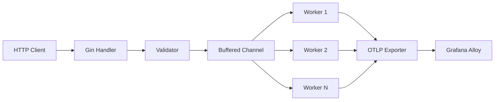

# OpenQoE Worker

High-performance OTLP ingestion worker for OpenQoE v2.

## Overview

The Go based Worker is the core ingestion component of OpenQoE v2. It replaces the legacy Cloudflare Worker with a more scalable, concurrent, and OTel-native implementation.

### Key Features

- **OTLP Native**: Implements OpenTelemetry Protocol for event export.
- **Concurrent Processing**: Uses a worker pool pattern for high-throughput ingestion.
- **Gin Web Framework**: Robust routing and middleware support.
- **Cardinality Governance**: In-memory tracking of dimension cardinality to protect downstream backends.
- **Health & Stats**: Integrated operational endpoints for monitoring.

---

## Getting Started

### Prerequisites

- Go 1.25+
- Access to an OTLP-compatible collector (e.g., Grafana Alloy)

### Build & Run

1. **Install Dependencies**:

   ```bash
   go mod download
   ```

2. **Configure Environment**:

   ```bash
   cp .env.example .env
   # Edit .env with your OTEL_URL (default: http://localhost:4317)
   ```

3. **Build**:

   ```bash
   go build -o openqoe-worker
   ```

4. **Run**:
   ```bash
   ./openqoe-worker
   ```

The worker will start on port `8788`.

---

## API Endpoints

| Endpoint     | Method | Description                     |
| ------------ | ------ | ------------------------------- |
| `/v2/events` | `POST` | Ingest playback events          |
| `/v2/health` | `GET`  | Service health status           |
| `/v2/stats`  | `GET`  | Operational stats & cardinality |

### Event Ingestion

`POST /v2/events`

Accepts a JSON body containing an array of events. See [API Reference](../docs/api-reference.md) for the full schema.

---

## Environment Variables

| Variable           | Default                 | Description                    |
| ------------------ | ----------------------- | ------------------------------ |
| `OTEL_URL`         | `http://localhost:4317` | OTLP collector endpoint        |
| `API_KEY`          | -                       | Secret key for auth middleware |
| `LOG_LEVEL`        | `info`                  | zap logger level               |
| `DESTINATION_TYPE` | `SelfHosted`            | `SelfHosted` or `GrafanaCloud` |

---

## Architecture

The worker follows a producer-consumer pattern:

1. **Producer**: Gin handlers receive HTTP requests, validate them, and push events into a buffered channel.
2. **Consumer**: A pool of worker goroutines reads from the channel, processes events (cardinality checks, enrichment), and exports them via OTLP.


